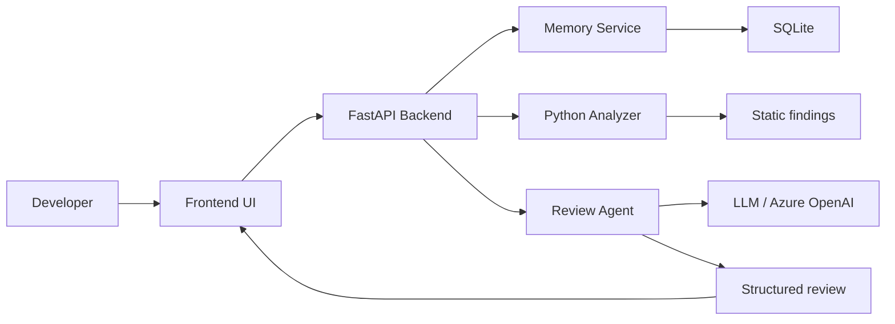

# Code Review Agent

## Project overview

Code Review Agent is an AI-powered code review assistant that learns a team's coding standards and uses that context in future reviews.

The prototype is designed for a hackathon demo and focuses on a working end-to-end workflow: submit code, run static and AI checks, compare against team rules and prior review memory, generate a review, and store accepted feedback so future reviews become more specific and more useful.

## Problem statement

Most code review tools check code in isolation. They do not learn the team's standards, previous architectural decisions, or recurring mistakes. This project addresses that gap by combining static code analysis, memory of team rules, and review history into a single reviewing workflow.

## Key innovation

Traditional code review tools check the code.
Our Code Review Agent remembers how your team writes code.

The agent stores:
- team rules
- accepted suggestions
- rejected suggestions
- prior findings
- previous similar issues

It then retrieves the most relevant context during future reviews and emphasizes team-specific findings instead of generic warnings.

## Architecture



## Tech stack

- React + Vite + TypeScript
- Tailwind CSS
- FastAPI + Python
- SQLite
- Azure OpenAI compatible API
- Python AST analysis

## Setup instructions

### 1. Backend

```bash
cd backend
python -m venv .venv
source .venv/bin/activate  # Windows: .venv\Scripts\activate
pip install -r requirements.txt
cp .env.example .env
```

### 2. Frontend

```bash
cd frontend
npm install
npm run dev
```

## Environment variables

Create a backend .env file based on .env.example.

Required variables:

```env
AZURE_OPENAI_ENDPOINT=
AZURE_OPENAI_API_KEY=
AZURE_OPENAI_DEPLOYMENT=
AZURE_OPENAI_API_VERSION=2024-02-01
APP_ENV=development
DATABASE_URL=sqlite:///./code_review_agent.db
```

If AI credentials are missing, the application runs in deterministic demo mode and still demonstrates the memory workflow.

## Run backend

```bash
cd backend
source .venv/bin/activate
uvicorn app.main:app --reload --host 0.0.0.0 --port 8000
```

## Run frontend

```bash
cd frontend
npm install
npm run dev -- --host 0.0.0.0 --port 5173
```

## API documentation

Once the backend is running, OpenAPI docs are available at:

- http://localhost:8000/docs
- http://localhost:8000/redoc

### Core endpoints

- POST /api/review
- GET /api/rules
- POST /api/rules
- DELETE /api/rules/{id}
- GET /api/reviews
- GET /api/reviews/{id}
- POST /api/feedback
- POST /api/demo/reset

## Demo instructions

1. Open the frontend.
2. Add the rule: "Database calls must not happen directly inside controllers. Use the Repository/Service layer."
3. Submit a Python controller with database access in a route handler.
4. Review the generated architecture violation.
5. Accept the feedback.
6. Submit similar code again.
7. Confirm that the agent now references the earlier memory and team rule.

## Example team rules

- Database calls must not happen directly inside controllers.
- Use the Repository/Service layer.
- Authentication logic belongs in the service layer.
- Functions should use type hints.
- Avoid duplicated business logic.
- Use meaningful variable names.
- API errors should be handled consistently.

## Example code

```python
@app.get("/users")
def get_users():
    users = db.query("SELECT * FROM users")
    return users
```

## Future improvements

- semantic retrieval using embeddings
- commit-aware review context
- GitHub PR integrations
- richer AST and lint rules for multiple languages
- team-specific rule tuning via feedback loops

## License

This project is for hackathon prototype purposes.
